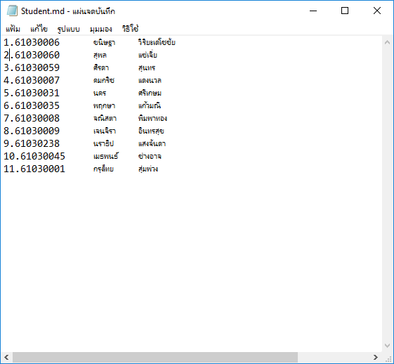

1.61030006	ขนิษฐา​	วิริยะเดโชชัย
2.61030060​	สุพล	แซ่เจี่ย
3.61030059	ศิรดา	สุนทร
4..61030007	คมกริช	แดงนวล
5.61030031	นคร	ศรีเกษม
6.61030035	พฤกษา	แก้วมณี
7.61030008	จณิสตา	พิมพาทอง
8.61030009	เจนจิรา	อินทรสุข
9.61030238	นราธิป	แสงจันดา 
10.61030045	เมธพนธ์	ช่างอาจ 
11.61030001	กรุงไทย	สุ่มพ่วง

ผลการทดลอง

   

12.61030017	ณปกรณ์	สุขเกษม
13.61030050	วรรษพร	ขุนทร 
14.61030040	พีระพล	สายยศ 
15.61030055	ศุภพิชญ์ สุขะ 
16.61030057	สกุลรัตน์	ปลูกสกุล 
17.61030054	ศุภกร	มาประชุม 
18.61030236	ชลลดา	ผลดี 
19.61030020	ณัฐดนัย	เอี่ยมสอาด 
20.61030243	วิศวะ	ดำชมทรัพย์ 
21.61030242	วรินรำไพ	ขุนภักดี

ผลการทดลอง

   

